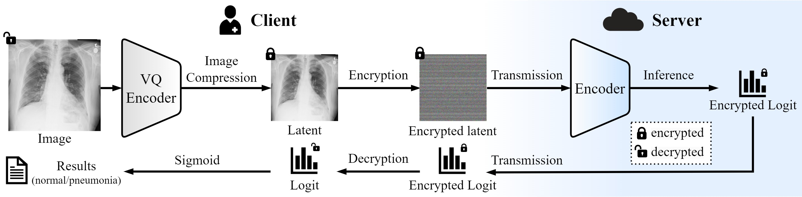

# Paper

Privacy-Preserving Chest X-ray Classification in Latent Space with Homomorphically Encrypted Neural Inference [Jonghun Kim], [Gyeongdeok Jo], [Sinyoung Ra], [Hyunjin Park] <br>

 [](https://papers.miccai.org/miccai-2025/paper/0621_paper.pdf) [](https://arxiv.org/abs/2506.15258)

# Overview

This repository contains the code for Privacy-Preserving Chest X-ray Classification in Latent Space with Homomorphically Encrypted Neural Inference. 




# Datasets

- CheXpert dataset: https://stanfordmlgroup.github.io/competitions/chexpert/

- NIH dataset: https://www.kaggle.com/datasets/nih-chest-xrays/data


# HE-inference Test

To use a simulation environment for inference latency testing, fork the code from HEAR.(https://github.com/K-miran/HEAR).


## Compression Models 

Google drive to get a pre-trained image compression model: 

https://drive.google.com/drive/folders/1IdkwJwg-Q2HqcQD7GzgJZITWo9jSH7CH?usp=sharing


# Citation

```bibtex
@InProceedings{KimJon_Privacy_MICCAI2025,
        author = { Kim, Jonghun and Jo, Gyeongdeok and Ra, Sinyoung and Park, Hyunjin},
        title = { { Privacy Preserving Chest X-ray Classification in Latent Space with Homomorphically Encrypted Neural Inference } },
        booktitle = {proceedings of Medical Image Computing and Computer Assisted Intervention -- MICCAI 2025},
        year = {2025},
        publisher = {Springer Nature Switzerland},
        volume = {LNCS 15973},
        month = {September},
        page = {497 -- 507}
}
```

